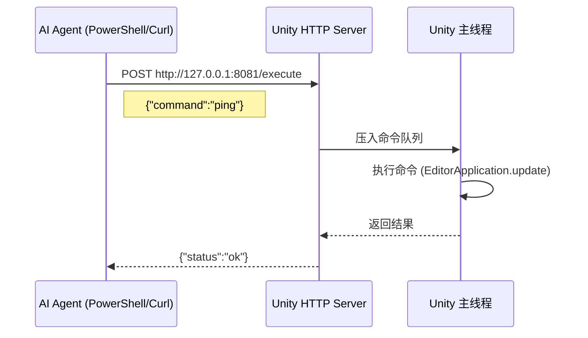

# Unity 通信桥接 MVP 方案

## 目标
实现 AI Agent 与 Unity 编辑器之间的基础通信能力。

---

## 最小化架构



---

## 实现步骤

### Step 1: 创建 HTTP Server

**文件**: `Assets/Editor/AI_Internal/AIBridgeServer.cs`

```csharp
using UnityEngine;
using UnityEditor;
using System;
using System.Net;
using System.Text;
using System.Threading;
using System.IO;

namespace AI_Internal
{
    [InitializeOnLoad]
    public class AIBridgeServer
    {
        private static HttpListener listener;
        private static Thread listenerThread;
        private static bool isRunning = false;
        private const int PORT = 8081;

        static AIBridgeServer()
        {
            // Unity 启动时自动初始化
            EditorApplication.update += Initialize;
        }

        private static void Initialize()
        {
            EditorApplication.update -= Initialize;
            StartServer();
        }

        [MenuItem("AI/Start Server")]
        public static void StartServer()
        {
            if (isRunning)
            {
                Debug.LogWarning("[AI Bridge] Server already running");
                return;
            }

            try
            {
                listener = new HttpListener();
                listener.Prefixes.Add($"http://127.0.0.1:{PORT}/");
                listener.Start();
                isRunning = true;

                listenerThread = new Thread(ListenLoop);
                listenerThread.IsBackground = true;
                listenerThread.Start();

                Debug.Log($"[AI Bridge] Server started on http://127.0.0.1:{PORT}");
            }
            catch (Exception e)
            {
                Debug.LogError($"[AI Bridge] Failed: {e.Message}");
            }
        }

        [MenuItem("AI/Stop Server")]
        public static void StopServer()
        {
            if (!isRunning) return;

            isRunning = false;
            listener?.Stop();
            listener?.Close();

            Debug.Log("[AI Bridge] Server stopped");
        }

        private static void ListenLoop()
        {
            while (isRunning)
            {
                try
                {
                    var context = listener.GetContext();
                    ThreadPool.QueueUserWorkItem(_ => HandleRequest(context));
                }
                catch (Exception e)
                {
                    if (isRunning) Debug.LogError($"[AI Bridge] Error: {e.Message}");
                }
            }
        }

        private static void HandleRequest(HttpListenerContext context)
        {
            var request = context.Request;
            var response = context.Response;

            try
            {
                string responseText = "";

                if (request.HttpMethod == "GET")
                {
                    // 健康检查
                    responseText = "{\"status\":\"ok\",\"service\":\"Unity AI Bridge\"}";
                }
                else if (request.HttpMethod == "POST")
                {
                    // 读取请求体
                    using (var reader = new StreamReader(request.InputStream, request.ContentEncoding))
                    {
                        string requestBody = reader.ReadToEnd();
                        Debug.Log($"[AI Bridge] Received: {requestBody}");
                        
                        // 暂时直接返回回显
                        responseText = $"{{\"status\":\"received\",\"echo\":\"{requestBody}\"}}";
                    }
                }

                // 返回响应
                byte[] buffer = Encoding.UTF8.GetBytes(responseText);
                response.ContentLength64 = buffer.Length;
                response.ContentType = "application/json";
                response.OutputStream.Write(buffer, 0, buffer.Length);
            }
            catch (Exception e)
            {
                response.StatusCode = 500;
                byte[] buffer = Encoding.UTF8.GetBytes($"{{\"error\":\"{e.Message}\"}}");
                response.OutputStream.Write(buffer, 0, buffer.Length);
            }
            finally
            {
                response.OutputStream.Close();
            }
        }
    }
}
```

---

## 验证测试

### 1. Unity 端启动
- 打开 Unity 编辑器
- 菜单: `AI > Start Server`
- Console 应显示: `[AI Bridge] Server started on http://127.0.0.1:8081`

### 2. Agent 端测试

**健康检查**:
```powershell
curl http://127.0.0.1:8081
```
预期返回: `{"status":"ok","service":"Unity AI Bridge"}`

**发送命令**:
```powershell
curl -X POST http://127.0.0.1:8081/execute `
  -H "Content-Type: application/json" `
  -d '{"command":"ping"}'
```
预期返回: `{"status":"received","echo":"..."}`

---

## 成功标准

- [x] Unity 启动时 HTTP Server 自动运行
- [x] Agent 能成功发送请求
- [x] Unity Console 能看到请求日志
- [x] Agent 能收到 JSON 响应

---

## 下一步

通信验证成功后，继续实现：
1. **主线程调度器** (MainThreadDispatcher)
2. **命令解析和执行** (ExecuteCommand)
3. **5个基础命令** (ping, CreateCube, DeleteObject, GetHierarchy, Log)

参考完整方案: `docs/full_implementation_plan.md`
