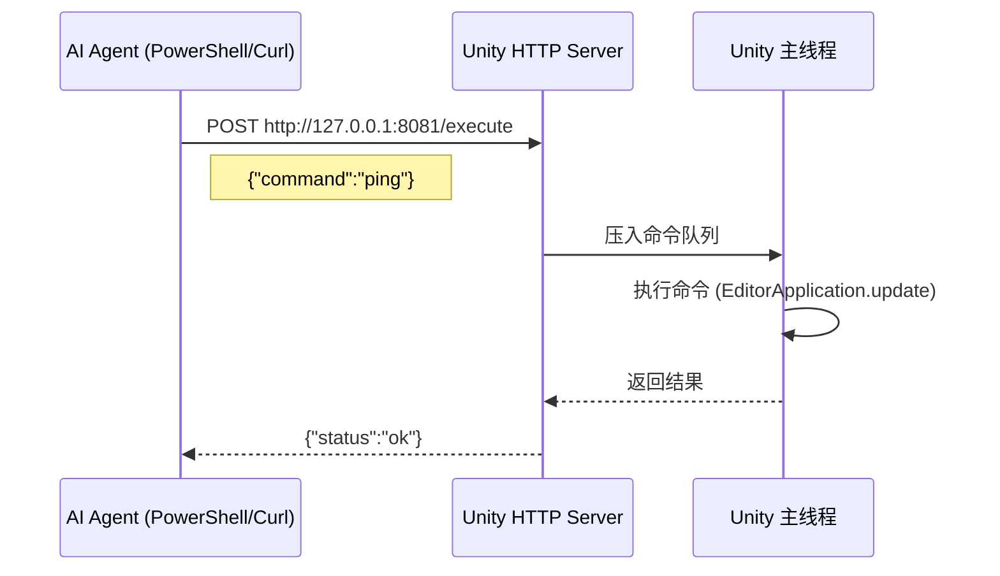

# Unity 通信桥接 MVP 方案

## 目标
实现 AI Agent 与 Unity 编辑器之间的基础通信能力。

---

## 最小化架构

## 下一步

通信验证成功后，继续实现：
1. **主线程调度器** (MainThreadDispatcher)
2. **命令解析和执行** (ExecuteCommand)
3. **5个基础命令** (ping, CreateCube, DeleteObject, GetHierarchy, Log)

参考完整方案: `docs/full_implementation_plan.md`
